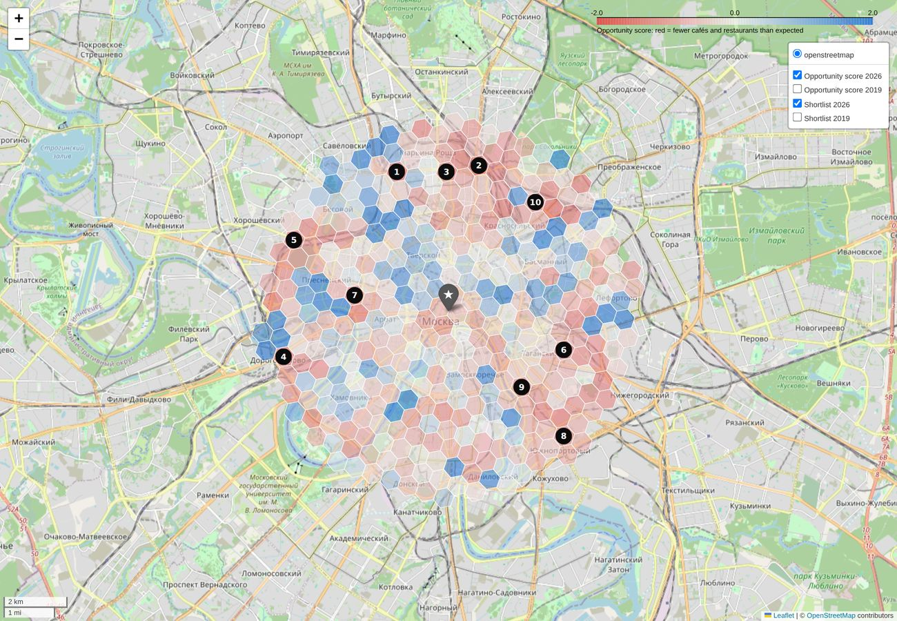

# Where to open a café in central Moscow

Capstone project of the IBM Data Science Professional Certificate (Coursera, *Applied Data Science
Capstone*, "the Battle of the Neighbourhoods"). The data was collected in 2019; the analysis was
completed in 2026.

**Question:** which places within 6 km of Red Square have the footfall generators that usually
support many cafés (metro exits, shops, consumer services, parking, universities), yet host
noticeably fewer cafés and restaurants than comparable places?



*Map tiles © OpenStreetMap contributors.*

## Findings

- The historic core is saturated: inside the Garden Ring places already have as many cafés as their
  footfall generators suggest, or more.
- A Poisson model of competitor density, fitted on the 2019 city registers, explains 67% of the
  deviance under spatial cross-validation. Every kilometre from Red Square takes about 22% off the
  expected number of cafés and restaurants and every 100 m from the metro about 4.5%; twice as many
  shops add about 26%, twice as many consumer services about 18%.
- Seven years later the cells that were most under-served in 2019 had 69% more cafés and restaurants
  (OpenStreetMap 2026), the most saturated ones 11% fewer. The direction agrees with the model, but
  2020-2026 (the pandemic, the war and sanctions, the exit of foreign chains, fewer tourists) moved
  cafés from transit hubs to residential streets on its own, so the check supports the method
  without proving it.
- The same pipeline with the competitors of 2026 gives today's shortlist. The most robust candidates
  are around **Savyolovskaya, Maryina Roshcha, Begovaya, Ploshchad Ilyicha and Krasnopresnenskaya**;
  the full top 10 and the caveats are in the report.

Read the [**report**](report/REPORT.md) ([по-русски](report/REPORT.ru.md)), or the analysis notebook
itself: [`notebooks/03_cafe_location_analysis.ipynb`](notebooks/03_cafe_location_analysis.ipynb)
(the interactive maps render on
[nbviewer](https://nbviewer.org/github/petro1eum/capstone/blob/master/notebooks/03_cafe_location_analysis.ipynb),
not on GitHub). `report/report_ru.html` is a self-contained Russian page with an interactive map;
it opens in a browser once downloaded.

## Repository

| Path | Content |
|---|---|
| `notebooks/01_data_collection_moscow_open_data.ipynb` | 2019: candidate grid around Red Square, Moscow Open Data layers |
| `notebooks/02_foursquare_central_districts.ipynb` | 2019: Foursquare venues and k-means of the central districts (exploratory) |
| `notebooks/03_cafe_location_analysis.ipynb` | The analysis: features, typology, demand model, opportunity score, the 2019 shortlist, the check against 2026, the 2026 shortlist |
| `src/moscow_cafes/` | Data loaders, projection and neighbourhood counts, chain-name cleaning, Overpass client |
| `scripts/fetch_osm_data.py` | Refreshes the OpenStreetMap snapshot in `data/osm/` |
| `scripts/build_report_page.py` | Builds the Russian report page `report/report_ru.html` from the notebook's outputs |
| `data/` | Moscow Open Data (2019), the raw registers restored from the 2019 Dropbox and the OpenStreetMap snapshot; see [`data/README.md`](data/README.md) |
| `report/` | Reports in English and Russian, figures, interactive maps, scores of all cells and both shortlists |
| `tests/` | Unit tests of the helpers and data checks |

## Running it

```bash
python -m venv .venv && source .venv/bin/activate
pip install -r requirements.txt
pytest                                    # helpers and data checks
jupyter lab notebooks/03_cafe_location_analysis.ipynb
python scripts/build_report_page.py       # the Russian page, after the notebook
python scripts/fetch_osm_data.py          # optional: replace the OpenStreetMap snapshot
```

The notebook runs offline on the committed data in a few minutes and rewrites the figures, the
interactive map and the CSV files in `report/`. Notebooks 01 and 02 are kept as they ran in 2019: their download links and the
Foursquare v2 API are gone, and the credentials they used were removed from the code.

## Data sources

- Moscow Open Data portal, [data.mos.ru](https://data.mos.ru) (2019 extracts, the catering and
  shopping registers restored from the project's 2019 Dropbox).
- OpenStreetMap, © OpenStreetMap contributors, [ODbL](https://opendatacommons.org/licenses/odbl/).
- Yandex Geocoder (addresses of the grid cells, 2019).

The code is licensed under the GNU GPL v3, see [LICENSE](LICENSE).

## Кратко по-русски

Капстоун-проект курса IBM Data Science (Coursera): где в центре Москвы открыть кафе. Данные
собраны в 2019 году, анализ завершён в 2026-м.

- Центр в пределах 6 км от Красной площади покрыт сеткой из 364 шестиугольных ячеек. Для каждой
  посчитано, что находится в радиусе 300 м: кафе и рестораны из реестра общепита 2019 года, выходы
  метро, остановки, парковки, магазины, бытовые услуги и спортзалы (портал открытых данных Москвы),
  вузы (OpenStreetMap).
- Пуассоновская модель по генераторам трафика предсказывает, сколько кафе и ресторанов обычно бывает
  в таком месте. Она объясняет 67% девиансы на пространственной кросс-валидации. Каждый километр от
  центра уменьшает ожидаемое число заведений примерно на 22%, каждые 100 м до метро на 4,5%.
- Недообеспеченные ячейки, где конкурентов заметно меньше ожидаемого, ранжируются по
  стандартизованному разрыву, усреднённому по радиусам 250, 300 и 400 м.
- Через семь лет в самых недообеспеченных местах 2019 года кафе стало на 69% больше, в самых
  насыщенных на 11% меньше. Направление совпадает с моделью, но пандемия, война, санкции и уход
  иностранных сетей сами сдвигали кафе из транспортных узлов к жилым улицам, так что это подкрепляет
  метод, но не доказывает его.
- Исторический центр насыщен. Самые устойчивые кандидаты на 2026 год находятся у станций
  **Савёловская, Марьина Роща, Беговая, Площадь Ильича и Краснопресненская**, в 3–5,3 км от Красной
  площади.

Подробности в [отчёте на русском](report/REPORT.ru.md); интерактивная страница с картой:
`report/report_ru.html`.
