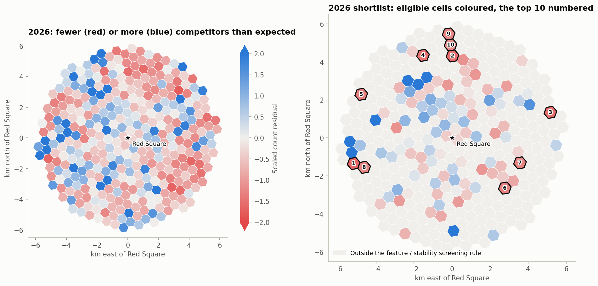

<!-- Generated by scripts/build_markdown_reports.py; edit the builder, not this file. -->
# Café counts and candidate areas in central Moscow

This analysis predicts **recorded café and restaurant counts**, using the surroundings of 364 grid cells
within 6 km of Red Square. A negative residual means fewer records than the model predicts. It does not
establish unmet consumer demand, available premises or the profitability of a new café. The output is a
fieldwork shortlist. [Русская версия](REPORT.ru.md) · [Interactive page in Russian](report_ru.html).

## Data and comparability

The sources are a 2019 city register and OpenStreetMap dated **2026-09-28**, containing
3,956 and 3,933 cafés and restaurants within 6 km.
Similar totals do not establish comparable local coverage. The two sources have different classifications
and completeness. Differences are not verified openings, closures or market growth. Neighbourhood count
sums differ from unique venue totals because nearby catchments can overlap.

The primary target counts cafés and restaurants equally; fast food is a separate sensitivity analysis.
Education measured in 2026 is excluded from the 2019 model, correlations and typology. The 2026 model
uses it, but retains 2019 parking capacities for lack of a comparable newer layer. Infrastructure and shops
are proxies, not observed pedestrian or passenger flows. See [data provenance](../data/README.md).

All distances use UTM 37N and **straight-line circles**. A 300 m radius is not a five-minute walking area;
rivers, railway tracks, private access and crossings are not routed.

## Model, validation and screening

The primary Poisson GLM has a log link, `log1p(min(x,c))` count features, and linear distances in km.
The 99th-percentile caps and standardisation are fitted on training rows only. Historical predictors are
shops, services, metro exits, stops, parking spaces, gyms and distances to metro and Red Square.
Contemporaneous education is added in the 2026 model.

Outer validation uses six folds of 2000×2000 m blocks, excluding training centres within
800 m of test centres. This removes shared objects between circles of up to 400 m, not all
longer-range spatial dependence. Each outer training subset tunes α from [0.1, 0.3, 1.0, 3.0, 10.0] using its
own inner six-fold spatial validation and the same buffer. Held-out responses do not affect preprocessing
or penalty selection for their predictions.

We repeat the procedure 50 times, seeds 0–49, and average out-of-fold predictions at each radius.
At 300 m, **Poisson-deviance D²** of the averaged prediction is **0.664** for 2019 and
**0.668** for 2026. Individual-split ranges are 0.629–0.674 and
0.629–0.677. D² is not ordinary R² or a business-success probability.
For 2026 counts with historical surroundings and no future education, D² = 0.570.

Diagnostic benchmarks use one outer split, seed 0, rather than the averaged predictions above:

| Model | D², seed 0 |
| --- | --- |
| Poisson GLM, linear distances | 0.654 |
| Poisson GLM, log1p distances | 0.643 |
| Gradient boosting, Poisson loss | 0.568 |

The primary GLM is chosen for interpretability. This table is not a further model-selection process with
an independently evaluated winner. Each radius uses a descriptive, NB2-scaled residual:

`score_r = (N_r - mu_r) / sqrt(mu_r + mu_r² / theta_r)`

The moment estimate is `theta = sum(mu²) / sum((N-mu)²-mu)` when the denominator is positive;
otherwise the Poisson limit is used. The final score averages the three radius scores after averaging
predictions. It is not a calibrated normal z statistic, and the radii are correlated.

A cell passes a repeat if at least two radii have a station entrance within 500 m, at least 10 shops plus
services, and an expected count at or above the grid median. Final eligibility requires this rule on the
averaged predictions and in at least 80% of repeats. We select up
to ten negative scores using **unrounded** values. The 80% cutoff is a declared screening policy, not a
significance level. Eligibility frequency and top-ten frequency describe different events.

## Conditional feature contrasts

For each count, the baseline is the rounded-up median positive count, explicitly displayed as `x → 2x`.
The correct cap-aware contrast is
`100 * (exp(beta * (log1p(min(2*x,c)) - log1p(min(x,c)))) - 1)`, with the unscaled coefficient beta.
It depends on the starting count and cap; there is no universal effect of doubling a count.

| Contrast | Prediction change | 95% conditional interval |
| --- | --- | --- |
| Red Square: +1000 m | -23.05% | -30.00% … -18.03% |
| Metro exit: +100 m | -4.49% | -7.71% … -1.02% |
| Gyms: 1 → 2 | -3.65% | -15.50% … +11.28% |
| Bus and tram stops: 4 → 8 | -0.57% | -8.89% … +8.72% |
| Parking spaces: 142 → 284 | +3.17% | -2.86% … +9.20% |
| Metro exits: 2 → 4 | +4.15% | -1.90% … +10.91% |
| Consumer services: 7 → 14 | +15.32% | +4.02% … +28.43% |
| Shops: 13 → 26 | +27.73% | +22.05% … +35.63% |

The 300 block-bootstrap replicates refit preprocessing, but condition on the specification, baseline
contrasts and fixed selected α = 0.3. They do not account for model-selection uncertainty.
A zero-covering interval does not establish absence of association. These are conditional model contrasts,
not causal effects of adding shops, services or stations.

## The 2026 fieldwork shortlist

Counts, expectations and prediction ranges refer to 300 m; scores combine three radii. Eligibility and
top-ten frequencies describe the 50 splits. The 10th–90th percentiles describe split sensitivity,
**not confidence intervals** or future commercial outcomes.

| Rank | Area / station | Recorded | Prediction | Score | Eligible | Top 10 | 10–90% prediction |
| --- | --- | --- | --- | --- | --- | --- | --- |
| 1 | Кутузовский проспект, 35 / Кутузовская | 1 | 9.13 | -1.625 | 100% | 100% | 8.16–10.02 |
| 2 | улица Сущёвский Вал, 56 / Марьина Роща | 1 | 7.61 | -1.556 | 100% | 100% | 7.05–8.04 |
| 3 | Солдатский переулок, 8 / Лефортово | 2 | 10.60 | -1.528 | 98% | 96% | 7.77–12.63 |
| 4 | улица Сущёвский Вал, 9 с7 / Савёловская | 1 | 7.61 | -1.497 | 100% | 100% | 7.15–8.14 |
| 5 | Хорошёвское шоссе, 1 / Беговая | 4 | 10.87 | -1.339 | 98% | 86% | 8.12–13.40 |
| 6 | улица Крутицкий Вал, 3 с1 / Пролетарская | 9 | 27.84 | -1.306 | 100% | 92% | 25.89–29.88 |
| 7 | улица Рогожский Вал, 9/2 с2 / Римская | 4 | 11.48 | -1.291 | 100% | 92% | 10.23–12.61 |
| 8 | Киевская улица, 20 / Студенческая | 4 | 9.69 | -1.264 | 96% | 72% | 7.83–11.28 |
| 9 | Веткина улица, 2А с3 / Марьина Роща | 3 | 11.72 | -1.260 | 100% | 76% | 10.33–13.21 |
| 10 | Шереметьевская улица, 8 / Марьина Роща | 7 | 16.87 | -1.200 | 100% | 50% | 15.56–19.30 |

A stricter sensitivity badge requires top-ten membership in at least 80% of repeats, rank at most 12 at
all three radii, and top-ten membership both with fast food and with historical surrounding layers.
Cells passing all these checks: **#2 Марьина Роща; #4 Савёловская; #5 Беговая; #6 Пролетарская**. These checks reuse data and are not independent
confirmations of commercial potential; failing one is not proof of an unsuitable site.

Strong negative residuals outside final eligibility remain visible:

| Area / station | Score | Eligible |
| --- | --- | --- |
| Русаковская улица, 8 c3 / Митьково | -1.773 | 20% |
| улица Мельникова, 23 / Пролетарская | -1.683 | 0% |
| Рабочая улица, 37 / Римская | -1.625 | 0% |
| проспект Мира, 88 с4 / Рижская | -1.591 | 2% |
| Новоостаповская улица, 5 с2 / Волгоградский проспект | -1.540 | 0% |

Lefortovo station opened on [27 March 2020](https://www.metrostroy.ru/projects/1059-lefortovo-severo-vostochnyj-uchastok-tpk/), not in 2023. Two snapshots cannot date the
onset of a residual or show that cafés have not had time to respond to a station opening. The same
limitation applies to proposed explanations of the Mitkovo results.

## Comparing the 2019 register and 2026 OSM

Quintiles are defined by 2019 residuals, lowest first. The final column compares sums of source records,
not market growth. Coverage changes, baseline selection and regression to the mean can produce apparent
convergence, so this comparison does not validate unmet demand or business recommendations.

| 2019 residual quintile | Cells | 2019 register | 2026 OSM | Ratio of sums |
| --- | --- | --- | --- | --- |
| 1 | 73 | 102 | 208 | 2.039 |
| 2 | 73 | 371 | 438 | 1.181 |
| 3 | 72 | 604 | 697 | 1.154 |
| 4 | 73 | 1065 | 1000 | 0.939 |
| 5 | 73 | 1517 | 1348 | 0.889 |

The exploratory regression models `log((N2026+1)/(N2019+1))` using `log(N2019+1)` and `log(mu2019)`.
At an equal baseline count, doubling the prediction is associated with a change in the conditional
**geometric mean of `N2026+1`**. Estimate, lower and upper 95% block-bootstrap limits:
**+10.87%, +1.76%, +19.13%**; adding distance to Red Square gives
**+4.96%, -4.21%, +13.45%**. This is not an arithmetic mean count-growth effect. Bootstrap
intervals condition on existing predictions and do not refit the count model or model source errors.

| Type | Cells | 2019 register | 2026 OSM |
| --- | --- | --- | --- |
| Transit hubs | 50 | 1474 | 1275 |
| Central neighbourhoods | 98 | 1510 | 1557 |
| Residential belt | 141 | 603 | 694 |
| Parks, rail and industrial land | 75 | 72 | 165 |

The cluster names are descriptive, and baseline café counts enter the clustering. The k=4 silhouette is
0.184, indicating weak separation. Cluster differences and distance adjustment do
not separately identify the effects of the pandemic, war, sanctions, tourism or chain exits.

Historical shortlist, reconstructed now using the corrected method:

| Rank | Area / station | Recorded | Prediction | Score | Eligible | Top 10 | 10–90% prediction |
| --- | --- | --- | --- | --- | --- | --- | --- |
| 1 | Стройковская улица, 10 / Пролетарская | 1 | 11.19 | -1.565 | 100% | 100% | 10.31–11.93 |
| 2 | Шереметьевская улица, 8 / Марьина Роща | 4 | 20.52 | -1.421 | 100% | 100% | 17.52–22.99 |
| 3 | Ленинский проспект, 39А / Ленинский проспект | 1 | 9.44 | -1.336 | 94% | 94% | 7.95–10.95 |
| 4 | Гончарная набережная, 3 с1 / Таганская | 2 | 14.08 | -1.255 | 100% | 98% | 13.31–15.08 |
| 5 | Крестьянская площадь, 10 с1 / Пролетарская | 1 | 7.22 | -1.246 | 86% | 86% | 6.26–7.97 |
| 6 | улица Крутицкий Вал, 3 с1 / Пролетарская | 9 | 27.50 | -1.218 | 100% | 94% | 24.98–30.35 |
| 7 | Комсомольский проспект, 33/11 / Фрунзенская | 2 | 10.90 | -1.207 | 100% | 92% | 10.22–11.82 |
| 8 | проспект Мира, 88 с4 / Рижская | 2 | 8.13 | -1.206 | 100% | 92% | 7.33–9.10 |
| 9 | Большая Декабрьская улица, вл11 / Улица 1905 года | 5 | 15.95 | -1.185 | 100% | 86% | 14.89–16.83 |
| 10 | улица Шухова, 14 / Шаболовская | 3 | 9.82 | -1.174 | 100% | 74% | 8.37–11.33 |

This is not a forecast issued in 2019. A consistent longitudinal source and a prespecified evaluation
would be needed to test real openings, closures and the usefulness of the screening rule.

## Practical conclusion and reproduction

Use the list to check records, walking access, pedestrian flows, premises, rents and the proposed concept
on site. Positive residuals likewise do not prove oversupply: omitted offices, hotels, food halls, counting
units and model error may explain them. These data cannot establish payback or profitability.

Run `python scripts/run_analysis.py` to execute notebook 03 and rebuild both reports, README and HTML.
Committed snapshots allow offline computation. `cv_folds_2019.csv` and `cv_folds_2026.csv` record all 900
outer fits per year; `screening_stability_*.csv` contains all-cell diagnostics.
Runtime: python 3.14.6, numpy 2.4.6, pandas 2.3.3, scipy 1.17.1, scikit-learn 1.8.0, pyproj 3.8.0, matplotlib 3.10.7, folium 0.20.0.
Implementation: [model.py](../src/moscow_cafes/model.py); regression tests: [test_model.py](../tests/test_model.py).
