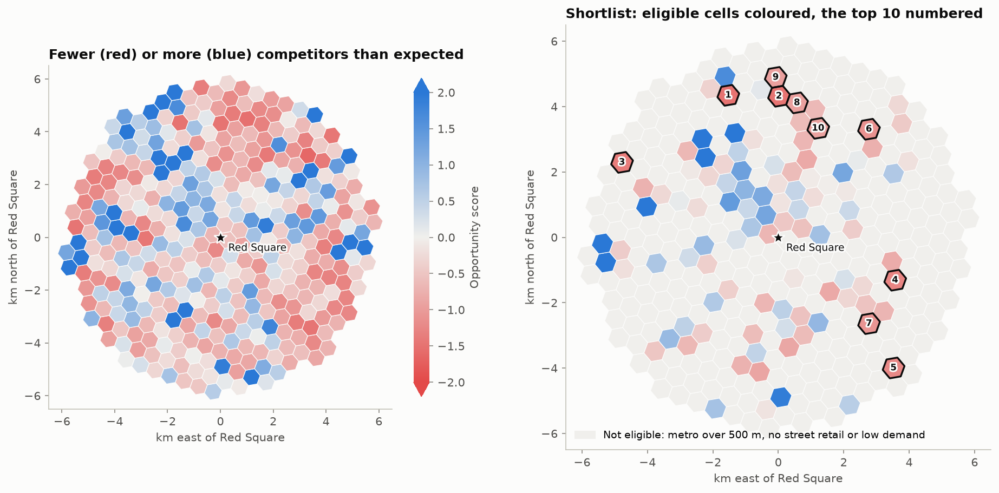

# Where to open a café in central Moscow?

*Applied Data Science Capstone (IBM / Coursera): the Battle of the Neighbourhoods, Moscow edition.*
The analysis behind this report is
[`notebooks/03_cafe_location_analysis.ipynb`](../notebooks/03_cafe_location_analysis.ipynb).

*Opportunity map; the [interactive version](cafe_opportunity_map.html) opens in a browser once
downloaded. Map tiles © OpenStreetMap contributors.*

## 1. Introduction: the business problem

Central Moscow is one of the densest café markets in Europe: within 6 km of Red Square
OpenStreetMap lists almost 4,000 cafés and restaurants. Opening one more café there is mostly a bet
on the location. A good site sits on a steady flow of people (commuters coming out of the metro,
shoppers, visitors of hairdressers and repair shops, students) but is not already crowded with
competitors that absorb that flow.

**Stakeholder.** An entrepreneur or a franchise developer who plans a new café (coffee, pastries,
light meals) in central Moscow and needs a short list of places worth a field visit and a rent
search.

**Question.** Which locations within 6 km of Red Square have the footfall generators that usually
support many cafés, yet host noticeably fewer cafés and restaurants than comparable places?

## 2. Data

| Layer | Source | Records | Used as |
|---|---|---:|---|
| Candidate locations | Hexagonal grid within 6 km of Red Square, 600 m step; addresses from the Yandex Geocoder | 364 | units of analysis |
| Metro entrances and exits | [data.mos.ru](https://data.mos.ru), 2019 | 1,067 | exits within 300 m, distance to the nearest exit |
| Surface transport stops | data.mos.ru, 2019 | 11,507 | stops within 300 m |
| Paid street parking | data.mos.ru, 2019 | 9,254 zones | parking spaces within 300 m |
| Shops | data.mos.ru shopping register, 2019 | 22,109 | shops within 300 m |
| Consumer services | data.mos.ru, 2019 | 14,540 | services within 300 m |
| Fitness | data.mos.ru, 2019 | 385 facilities | gyms within 300 m |
| Cafés, restaurants, fast food, bars | [OpenStreetMap](https://www.openstreetmap.org/copyright), 28 September 2026 | 6,729 | competitors: cafés and restaurants |
| Universities and colleges | OpenStreetMap, 28 September 2026 | 283 | universities within 300 m |

The grid and the Moscow Open Data layers were collected in 2019
([notebook 01](../notebooks/01_data_collection_moscow_open_data.ipynb)). The catering register of
data.mos.ru used then was never committed and its copy is gone, and data.mos.ru does not answer
outside Russia, so catering comes from an OpenStreetMap snapshot. Following the 2019 definition,
which kept only the *кафе* and *ресторан* types of the register, the **competitors are cafés and
restaurants**; fast food and bars are described but not counted. Universities and colleges replace
the education register step that was never finished. The cinema register (14 municipal cinemas) is
too sparse to use. Details and the data fixes are in [`data/README.md`](../data/README.md).

## 3. Methodology

1. **Projection.** All coordinates are projected to UTM zone 37N (EPSG:32637). The 2019 notebook
   used zone 33, whose central meridian is 22.6° west of Moscow; it overstated distances by 2.4%.
2. **Features.** For each candidate cell, the number of objects of every layer within 300 m (about
   four minutes on foot), the parking capacity within 300 m, and the distances to the nearest metro
   exit and to Red Square.
3. **Exploratory analysis.** Catering composition, chains, and Spearman correlations between
   competitor density and each footfall generator.
4. **Neighbourhood typology.** k-means on standardised features (log counts, distances in km),
   k = 4 chosen from the inertia curve and interpretability.
5. **Demand model.** A Poisson GLM predicts the number of competitors from the footfall generators
   only: `log(1 + count)` features capped at the 99th percentile, and linear distances. Gradient
   boosting with a Poisson loss serves as a flexible benchmark. Models are compared with **spatial
   cross-validation**: cells are grouped into 2 × 2 km blocks and the 38 blocks are dealt at random
   into 6 folds, so no cell is predicted by a model that saw its neighbours. The GLM's out-of-fold
   prediction is the expected number of competitors; its effects get 95% intervals from a block
   bootstrap (300 resamples).
6. **Opportunity score.** The standardised gap between the actual and the expected number of
   competitors, with a negative binomial variance (`expected + expected² / θ`) because the counts
   are overdispersed. The pipeline is run with 250, 300 and 400 m catchments and the three gaps are
   averaged, so the result does not hinge on one catchment size.
7. **Shortlist.** Eligible cells have, for at least two of the three catchments, a metro exit within
   500 m, at least 10 shops and services around them and at least the median expected demand. They
   are ranked by the opportunity score, most under-served first.

## 4. Results

### The market

Within 6 km of Red Square there are 6,121 catering venues: 2,459 cafés, 1,474 restaurants, 1,353
fast food outlets, 607 bars, 130 pubs, 60 ice cream parlours and 38 food courts. The 3,933 cafés and
restaurants are the competitors. 59 chains have five or more outlets there and run 22% of them; the
largest sell coffee.

### What goes together with cafés

Competitor density rises with consumer services (ρ = 0.62), shops (0.56), parking (0.47) and metro
exits (0.42), and falls with the distance to the metro (−0.53) and to Red Square (−0.58).

### Four types of places

| Type | Cells | Cafés and restaurants | Metro exits | Shops | Services | Nearest metro, m | From Red Square, km |
|---|---:|---:|---:|---:|---:|---:|---:|
| Transit hubs | 52 | 23 | 4 | 18 | 15 | 149 | 2.9 |
| Central neighbourhoods | 82 | 16 | 0 | 6 | 11 | 441 | 2.5 |
| Residential belt | 152 | 4 | 0 | 4 | 4 | 601 | 4.5 |
| Parks, rail and industrial land | 78 | 1 | 0 | 0 | 0 | 747 | 5.1 |

*Medians within 300 m of the cells of each type. The silhouette score is low for every k (0.16 for
k = 4), as usual for gradually changing urban fabric; the selection plots are in the notebook.*

### The demand model

| Model | D², spatial CV |
|---|---:|
| Poisson GLM, log distances | 0.52 |
| **Poisson GLM, linear distances** | **0.58** |
| Gradient boosting, Poisson loss | 0.54 |
| Average of the GLM and boosting | 0.58 |

Distances work better linearly (an exponential decay of density, the classic urban density
gradient) than as logarithms, which explode next to Red Square. Boosting does not beat the GLM and
averaging the two adds nothing, so the interpretable GLM gives the expected counts. The footfall
generators explain 58% of the Poisson deviance of competitor counts; the rest is what the data
does not see.

| Change | Expected cafés and restaurants | 95% interval |
|---|---:|---|
| 1 km farther from Red Square | −21% | −28% … −17% |
| 100 m farther from the nearest metro exit | −7% | −9% … −4% |
| Twice as many shops | +14% | +9% … +19% |
| Twice as many consumer services | +13% | +4% … +23% |
| Twice the parking spaces | +5% | +1% … +10% |
| Twice as many metro exits, bus stops, universities or gyms | not distinguishable from zero | |

### The shortlist

101 of the 364 cells are eligible. The counts are strongly overdispersed (Pearson dispersion 6.1,
negative binomial θ = 3.5), hence the negative binomial standardisation.

| # | Nearest metro | Address of the cell centre | Metro exit, m | From Red Square, km | Cafés and restaurants within 300 m | Expected | Score |
|---:|---|---|---:|---:|---:|---:|---:|
| 1 | Savyolovskaya | [Savyolovsky Drive](https://www.openstreetmap.org/?mlat=55.792391&mlon=37.595654#map=17/55.792391/37.595654) | 376 | 4.6 | 1 | 10.7 | −1.49 |
| 2 | Maryina Roshcha | [Festivalny Park](https://www.openstreetmap.org/?mlat=55.792416&mlon=37.620372#map=17/55.792416/37.620372) | 253 | 4.3 | 1 | 10.4 | −1.48 |
| 3 | Begovaya | [Khoroshyovskoye Highway, 1](https://www.openstreetmap.org/?mlat=55.773369&mlon=37.544541#map=17/55.773369/37.544541) | 4 | 5.3 | 4 | 14.1 | −1.36 |
| 4 | Ploshchad Ilyicha | [Rogozhsky Val Street, 9/2](https://www.openstreetmap.org/?mlat=55.742498&mlon=37.678702#map=17/55.742498/37.678702) | 439 | 3.8 | 4 | 14.9 | −1.27 |
| 5 | Dubrovka | [Sharikopodshipnikovskaya Street, 11/1](https://www.openstreetmap.org/?mlat=55.718383&mlon=37.678742#map=17/55.718383/37.678742) | 118 | 5.3 | 4 | 15.9 | −1.23 |
| 6 | Krasnoselskaya | [Krasnoselsky District](https://www.openstreetmap.org/?mlat=55.783833&mlon=37.664522#map=17/55.783833/37.664522) | 440 | 4.3 | 3 | 11.3 | −1.12 |
| 7 | Proletarskaya | [Krutitsky Val Street, 3/1](https://www.openstreetmap.org/?mlat=55.730433&mlon=37.666384#map=17/55.730433/37.666384) | 134 | 3.8 | 9 | 23.6 | −1.09 |
| 8 | Rizhskaya | [Verzemneka Street](https://www.openstreetmap.org/?mlat=55.7907&mlon=37.629204#map=17/55.7907/37.629204) | 465 | 4.2 | 5 | 11.3 | −0.94 |
| 9 | Maryina Roshcha | [4th Maryinoy Roshchi Drive](https://www.openstreetmap.org/?mlat=55.797583&mlon=37.618591#map=17/55.797583/37.618591) | 114 | 4.9 | 7 | 16.8 | −0.94 |
| 10 | Prospekt Mira | [Skryabinsky Lane, 12/14](https://www.openstreetmap.org/?mlat=55.783817&mlon=37.639812#map=17/55.783817/37.639812) | 455 | 3.6 | 6 | 15.0 | −0.93 |

All cells with their features and scores: [`cell_scores.csv`](cell_scores.csv); the shortlist:
[`shortlist.csv`](shortlist.csv).

**Robustness.** #1, #3, #4, #6 and #7 are eligible with every catchment, rank in the top 12 with
each of them, and stay in the top 10 when fast food counts as competition too (OpenStreetMap tags
some coffee counters as fast food). #5 Dubrovka is as stable across catchments but drops out once
the 11 fast food outlets around the market are counted. #8-#10 are a near tie with the cells just
below them.

## 5. Discussion

**The historic core is taken.** None of the ten cells lies inside the Garden Ring: the centre
already has as many cafés as its footfall generators suggest, or more. All shortlisted cells are
3.6-5.3 km from Red Square, around the Third Ring Road, within 470 m of a metro exit.

**Two kinds of opportunity.**

- *Almost no competitors yet* (#1 Savyolovskaya, #2 Maryina Roshcha): one café or restaurant within
  300 m where about ten are expected. #1 sits by the Savyolovsky electronics market (29 of its 34
  consumer services are electronics repair counters). A neighbourhood coffee shop or bakery-café
  would have the street to itself.
- *Busy places that are under-served for their size* (#3-#10): three to nine venues where 11-24 are
  expected, around transport interchanges and markets: Begovaya, Ploshchad Ilyicha, the Dubrovka
  clothing market, Krasnoselskaya, Proletarskaya, Rizhskaya, Maryina Roshcha and Prospekt Mira.
  These suit a larger café or a coffee-to-go counter for commuters and shoppers.

**What the model does not see.** The cells with the most surplus competitors are the Depo food
mall near Belorusskaya (75 venues where 9 are expected), the Moscow City towers (Delovoy Tsentr,
Mezhdunarodnaya) and the Khlebozavod creative cluster near Dmitrovskaya. Food halls, offices and
destination venues draw far more cafés than shops and metro exits predict, and the same blind spot
can make a place look under-served when its demand comes from something the data does not hold.

**Limitations.**

- The footfall layers are from 2019 and the catering snapshot from 2026. Stations opened after 2019
  (the rest of the Big Circle Line, the MCD lines) are missing from the metro layer, and the shops
  and services have surely changed since.
- OpenStreetMap is incomplete in places and tags inconsistently. Cafés inside markets and malls are
  the most likely to be missing, which matters for Dubrovka.
- Competitors are counted, not weighed: a ten-seat coffee counter counts as much as a 200-seat
  restaurant, and price level and concept are ignored.
- There is no data on rents, pedestrian counts, office floor space or incomes; the distance to Red
  Square stands in for tourists and offices.
- The shops layer holds 22,109 of the register's 60,320 shops.

**Next steps.** Visit the shortlisted places at peak hours, check vacant premises and asking rents,
add office and footfall data (business centres, mobile-operator counts) and refresh the 2019 layers.

## 6. Conclusion

The project looked for places in central Moscow where a new café would share the local footfall
with fewer competitors than usual. Moscow open data on transport, retail and services and
OpenStreetMap catering data were combined on a grid of 364 cells, and a count model learned how many
cafés and restaurants a place normally has given what surrounds it (58% of the deviance explained
under spatial cross-validation). Comparing that expectation with reality shows a saturated historic
core and, 3.5-5.5 km from Red Square, a belt of places next to metro stations with markedly fewer
cafés than expected. The strongest candidates are around Savyolovskaya, Begovaya, Ploshchad
Ilyicha, Krasnoselskaya and Proletarskaya.

The analysis narrows the search from the whole centre to about ten places. The final choice needs
what open data cannot give: a walk around at rush hour, the rent and the concept.
