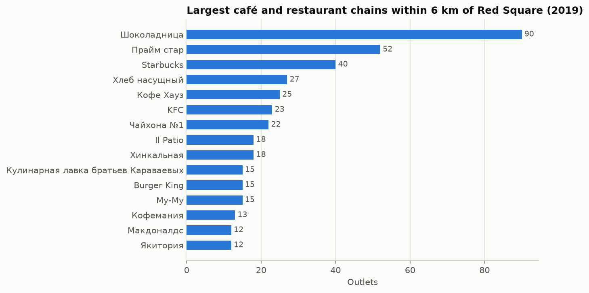
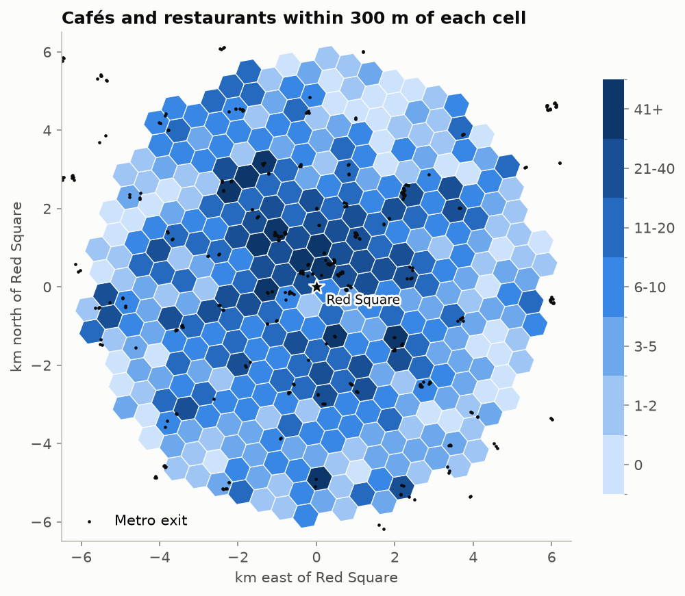
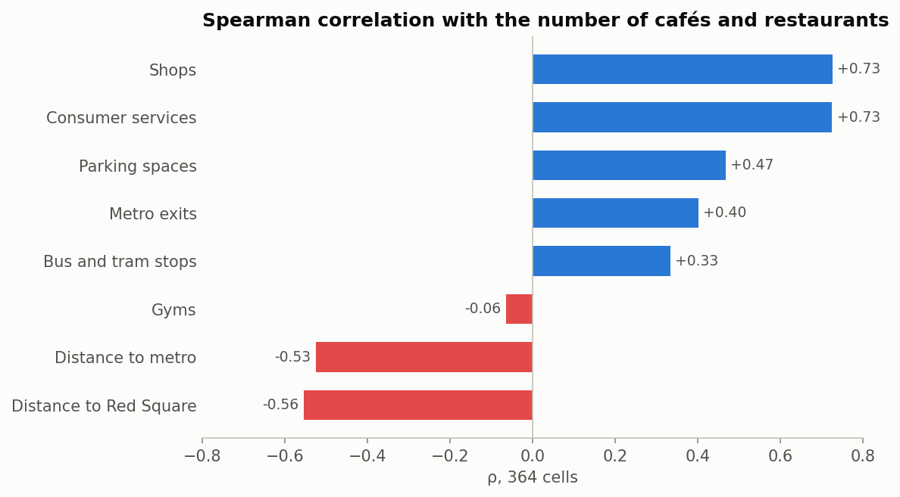
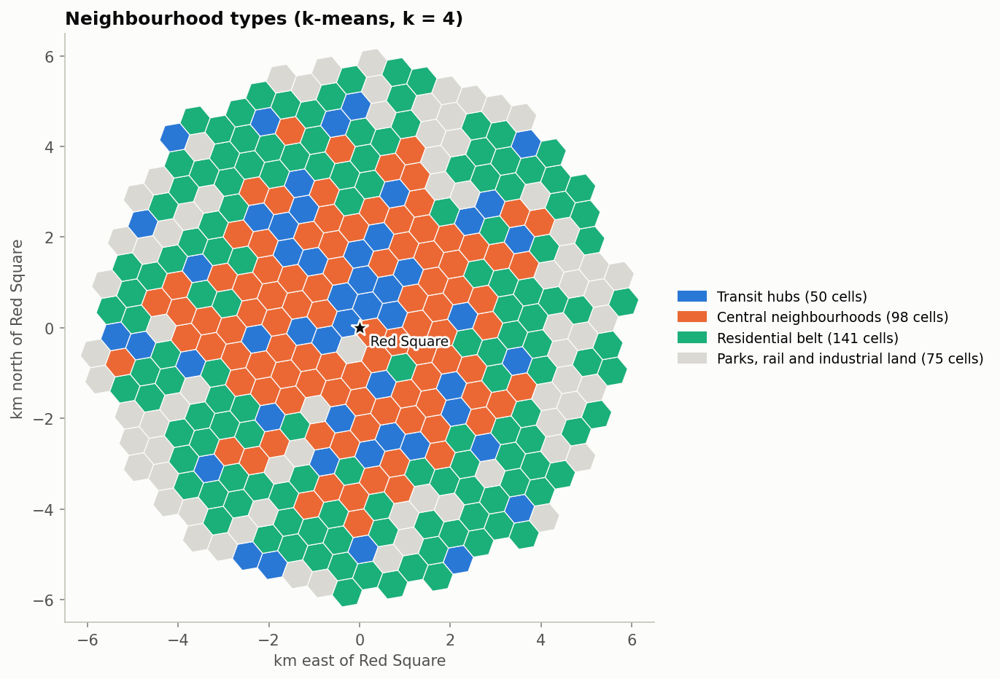
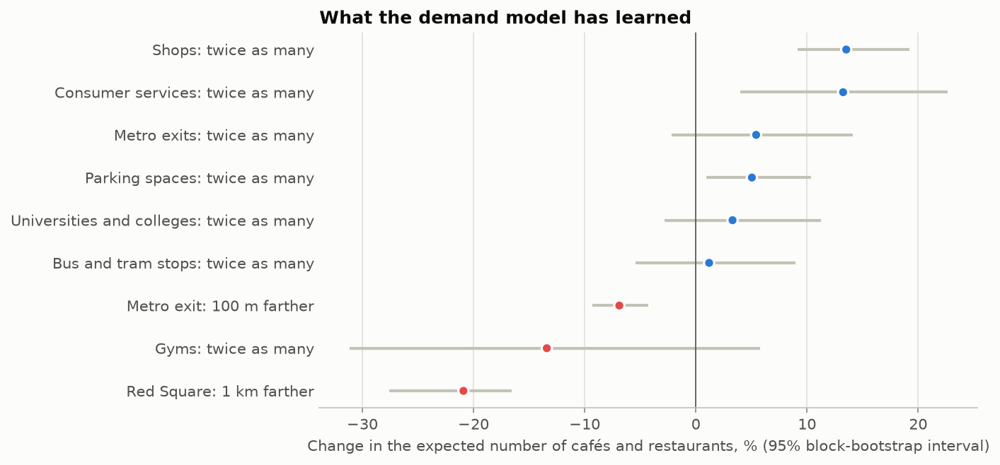
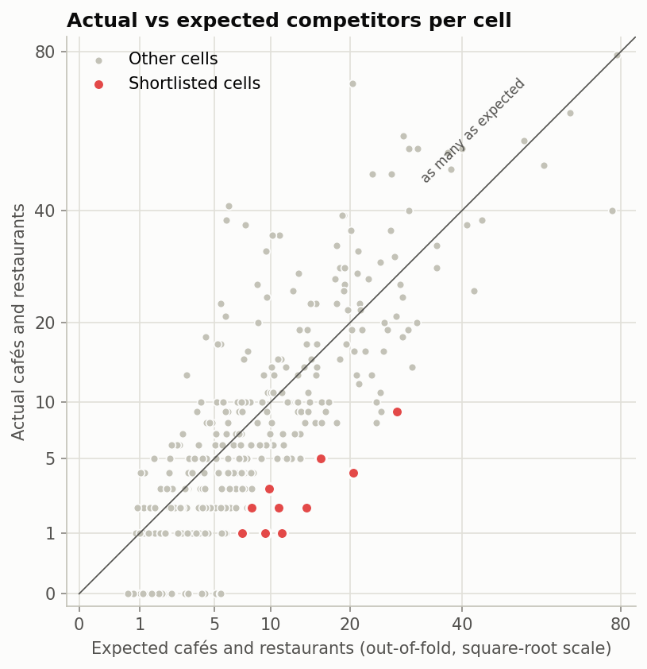
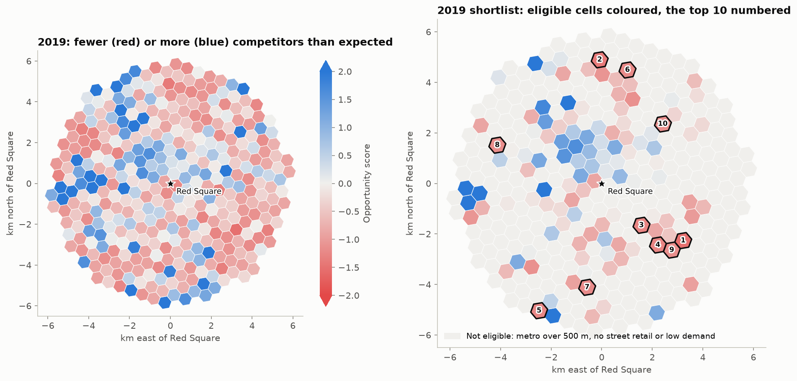
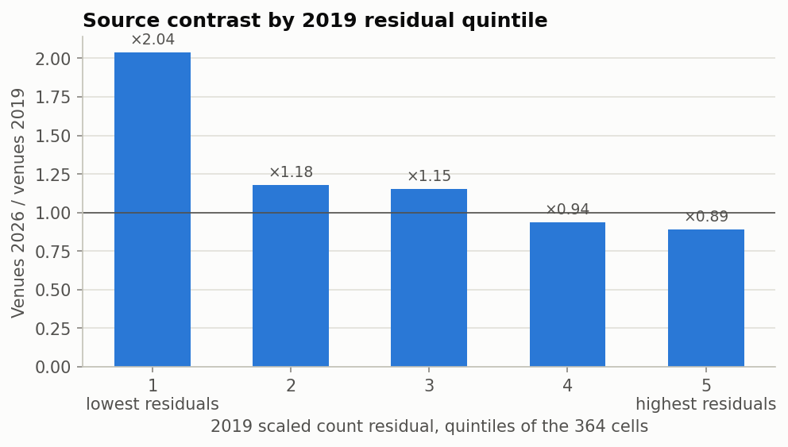

# Где открыть кафе в центре Москвы?

*Капстоун-проект курса Applied Data Science Capstone (IBM / Coursera), задание «Битва районов»,
московская версия.* Расчёты: ноутбук
[`notebooks/03_cafe_location_analysis.ipynb`](../notebooks/03_cafe_location_analysis.ipynb);
английская версия отчёта: [`REPORT.md`](REPORT.md). Подписи на графиках на английском, как в ноутбуке.

*Карта возможностей 2026 года; [интерактивная версия](cafe_opportunity_map.html) со слоями
2019 года открывается в браузере после скачивания. Подложка © участники OpenStreetMap.*

## 1. Введение: бизнес-задача

Центр Москвы входит в число самых плотных рынков кафе в Европе: в радиусе 6 км от Красной площади
городской реестр в 2019 году насчитывал почти 4 000 кафе и ресторанов. Открыть здесь ещё одно кафе
значит прежде всего сделать ставку на место. Хорошее место стоит на устойчивом потоке людей
(пассажиры метро, покупатели, посетители парикмахерских и мастерских, студенты), но этот поток ещё
не разобран конкурентами.

**Заказчик.** Предприниматель или развивающий франшизу менеджер, который планирует новое кафе
(кофе, выпечка, лёгкая еда) в центре Москвы, и ему нужен короткий список мест для выезда и поиска
аренды.

**Вопрос.** Где в радиусе 6 км от Красной площади есть генераторы трафика, которые обычно держат
много кафе, но кафе и ресторанов заметно меньше, чем в похожих местах?

Проект начат в 2019 году и закончен в 2026-м, поэтому появился ещё один вопрос: заполнились ли с тех
пор места, которые в 2019 году выглядели недообеспеченными?

## 2. Данные

| Слой | Источник | Записей | Как используется |
|---|---|---:|---|
| Ячейки-кандидаты | Шестиугольная сетка с шагом 600 м в радиусе 6 км от Красной площади | 364 | единицы анализа |
| Реестр общепита | [data.mos.ru](https://data.mos.ru), 2019: тип, число мест, признак сети | 15 366 | конкуренты: *кафе* и *ресторан* |
| Входы и выходы метро | data.mos.ru, 2019 | 1 067 | выходы в 300 м, расстояние до ближайшего |
| Остановки наземного транспорта | data.mos.ru, 2019 | 11 507 | остановки в 300 м |
| Платные парковки | data.mos.ru, 2019 | 9 254 зоны | парковочные места в 300 м |
| Реестр торговли | data.mos.ru, 2019 | 60 320 | магазины в 300 м |
| Бытовые услуги | data.mos.ru, 2019 | 14 540 | услуги в 300 м |
| Спорт | data.mos.ru, 2019 | 385 объектов | спортзалы в 300 м |
| Вузы и колледжи | [OpenStreetMap](https://www.openstreetmap.org/copyright), 28 сентября 2026 | 283 | вузы в 300 м |
| Кафе, рестораны, фастфуд, бары | OpenStreetMap, 28 сентября 2026 | 6 729 | проверка по 2026 году и шорт-лист 2026 |
| Входы станций метро, МЦК и МЦД | OpenStreetMap, 28 сентября 2026 | 427 | 2026: входы в 300 м, расстояние до ближайшего |
| Остановки | OpenStreetMap, 28 сентября 2026 | 2 261 | 2026: остановки в 300 м |
| Магазины | OpenStreetMap, 28 сентября 2026 | 11 437 | 2026: магазины в 300 м |
| Бытовые услуги | OpenStreetMap, 28 сентября 2026 | 3 767 | 2026: услуги в 300 м |
| Фитнес-клубы | OpenStreetMap, 28 сентября 2026 | 212 | 2026: фитнес-клубы в 300 м |

Сетка и слои открытых данных Москвы собраны в 2019 году
([ноутбук 01](../notebooks/01_data_collection_moscow_open_data.ipynb)). Реестры общепита и торговли
восстановлены в 2026 году из резервной копии Dropbox проекта (`data/dropbox_2019/`). Как и в 2019
году, **конкуренты это типы *кафе* и *ресторан* реестра общепита**; фастфуд, бары, столовые
и буфеты описаны, но не считаются. Реестр образования 2019 года содержит в основном школы
Департамента образования (534 из 620) и ни одного федерального вуза, поэтому вузы и колледжи взяты
из OpenStreetMap. Реестр кинотеатров (14 муниципальных кинотеатров) слишком мал для анализа. Для 2026
года генераторы трафика взяты из того же снимка OpenStreetMap, что и кафе, а теги подобраны под реестры
2019 года (слои OpenStreetMap покрывают 7 км вокруг Красной площади). Парковки остаются слоем 2019 года,
потому что OpenStreetMap редко знает вместимость уличных парковок. Подробности и исправления данных
описаны в [`data/README.md`](../data/README.md).

## 3. Методика

1. **Проекция.** Все координаты переведены в UTM, зона 37N (EPSG:32637). Ноутбук 2019 года работал
   в зоне 33, осевой меридиан которой на 22,6° западнее Москвы; расстояния завышались на 2,4%.
2. **Признаки.** Для каждой ячейки число объектов каждого слоя в радиусе 300 м (около четырёх
   минут пешком), вместимость парковок в 300 м, расстояния до ближайшего выхода метро и до Красной
   площади.
3. **Разведочный анализ.** Состав общепита, сети, ранговые корреляции Спирмена между плотностью
   конкурентов и каждым генератором трафика.
4. **Типология мест.** k-средних на стандартизованных признаках (логарифмы счётчиков, расстояния
   в км), k = 4 выбрано по кривой инерции и по интерпретируемости.
5. **Модель спроса.** Пуассоновская регрессия (GLM) предсказывает число конкурентов только по
   генераторам трафика: признаки `log(1 + число)` с обрезкой по 99-му перцентилю и линейные
   расстояния. Градиентный бустинг с пуассоновской функцией потерь служит гибким ориентиром. Модели
   сравниваются **пространственной кросс-валидацией**: ячейки сгруппированы в блоки 2 × 2 км, 38 блоков
   случайно разложены по 6 фолдам, так что ни одну ячейку не предсказывает модель, видевшая её
   соседей. Прогноз регрессии вне выборки и есть ожидаемое число конкурентов; 95% интервалы эффектов
   получены блочным бутстрэпом (300 повторов).
6. **Оценка возможности.** Стандартизованный разрыв между фактическим и ожидаемым числом
   конкурентов, с дисперсией отрицательного биномиального распределения (`ожидание + ожидание² / θ`),
   потому что счётчики сверхдисперсны. Расчёт повторён для радиусов 250, 300 и 400 м, три разрыва
   усреднены, чтобы результат не зависел от одного радиуса.
7. **Шорт-лист.** Проходят ячейки, где хотя бы при двух радиусах из трёх выход метро ближе 500 м,
   вокруг не меньше 10 магазинов и услуг, а ожидаемый спрос не ниже медианы. Они ранжируются по
   оценке, самые недообеспеченные первыми.
8. **Проверка по 2026 году.** OpenStreetMap показывает, где кафе и рестораны находятся в 2026 году.
   Если ожидание отражает спрос, недообеспеченные в 2019 году ячейки должны были получить новые
   заведения. Возврат к среднему учтён регрессией логарифма изменения на число заведений и ожидание
   2019 года (блочный бутстрэп, 1 000 повторов), шоки 2020–2026 годов учтены через расстояние до
   Красной площади и тип места.
9. **Шорт-лист 2026.** Тот же расчёт с кафе и ресторанами 2026 года в роли конкурентов и с генераторами
   трафика 2026 года, всё из OpenStreetMap.

## 4. Результаты

### Рынок в 2019 году

В радиусе 6 км от Красной площади реестр насчитывает 5 784 заведения общепита: 2 747 кафе,
1 209 ресторанов, 547 столовых, 450 баров, 448 точек быстрого обслуживания и закусочных и 383 буфета,
кафетерия и отдела кулинарии. Конкуренты это 3 956 кафе и ресторанов на 233 тысячи посадочных мест.
22% из них отмечены в реестре как сетевые, крупнейшие сети продают кофе.

### С чем связаны кафе

Плотность конкурентов растёт вместе с магазинами и бытовыми услугами (ρ = 0,73 для обоих),
парковочными местами (0,47) и выходами метро (0,40) и падает с расстоянием до метро (−0,53) и до
Красной площади (−0,56).

### Четыре типа мест

| Тип | Ячеек | Кафе и рестораны | Выходы метро | Магазины | Услуги | До метро, м | До Красной площади, км |
|---|---:|---:|---:|---:|---:|---:|---:|
| Транспортные узлы | 45 | 26 | 4 | 60 | 15 | 138 | 3,3 |
| Центральные кварталы | 76 | 15 | 0 | 22 | 12 | 438 | 2,5 |
| Жилой пояс | 157 | 4 | 0 | 12 | 5 | 573 | 4,3 |
| Парки, железные дороги и промзоны | 86 | 0 | 0 | 1 | 0 | 773 | 5,1 |

*Медианы в радиусе 300 м по ячейкам каждого типа. Силуэт низкий при любом k (0,17 при k = 4), как
обычно для плавно меняющейся городской ткани; графики выбора k есть в ноутбуке.*

### Модель спроса

| Модель | D², пространственная кросс-валидация |
|---|---:|
| Пуассоновская регрессия, логарифм расстояний | 0,62 |
| **Пуассоновская регрессия, линейные расстояния** | **0,67** |
| Градиентный бустинг, пуассоновская функция потерь | 0,63 |
| Среднее регрессии и бустинга | 0,67 |

Расстояния работают лучше линейно (экспоненциальное убывание плотности, классический градиент
плотности городской экономики), чем через логарифм, который взрывается у Красной площади. Бустинг не
превосходит регрессию, а их среднее ничего не добавляет, поэтому ожидания считает интерпретируемая
регрессия. Генераторы трафика объясняют две трети пуассоновской девиансы числа конкурентов; остальное
приходится на то, чего нет в данных. Обычная случайная кросс-валидация даёт почти то же (0,66).

| Изменение | Ожидаемое число кафе и ресторанов | 95% интервал |
|---|---:|---|
| На 1 км дальше от Красной площади | −22% | −28% … −17% |
| На 100 м дальше от ближайшего выхода метро | −4,5% | −6,9% … −2,0% |
| Вдвое больше магазинов | +26% | +21% … +30% |
| Вдвое больше бытовых услуг | +18% | +9% … +30% |
| Вдвое больше выходов метро | +8% | +0,3% … +16% |
| Вдвое больше парковочных мест, остановок, вузов или спортзалов | неотличимо от нуля | |

### Шорт-лист 2019 года

Фильтры проходят 117 из 364 ячеек. Счётчики сильно сверхдисперсны (дисперсия Пирсона 5,5,
θ отрицательного биномиального распределения 4,0), отсюда отрицательная биномиальная нормировка.
Факт и ожидание даны для радиуса 300 м; адреса это ближайшие адресные точки OpenStreetMap.

| № | Метро | Адрес центра ячейки | До выхода метро, м | До Красной площади, км | Кафе и рестораны, 2019 | Ожидание | Оценка | В OpenStreetMap 2026 |
|---:|---|---|---:|---:|---:|---:|---:|---:|
| 1 | Пролетарская | [Стройковская улица, 10](https://www.openstreetmap.org/?mlat=55.733882&mlon=37.673428#map=17/55.733882/37.673428) | 366 | 3,9 | 1 | 9,8 | −1,53 | 7 |
| 2 | Марьина Роща | [Шереметьевская улица, 8](https://www.openstreetmap.org/?mlat=55.797583&mlon=37.618591#map=17/55.797583/37.618591) | 114 | 4,9 | 4 | 18,2 | −1,40 | 7 |
| 3 | Таганская | [Гончарная набережная, 3 с1](https://www.openstreetmap.org/?mlat=55.739033&mlon=37.646976#map=17/55.739033/37.646976) | 377 | 2,3 | 2 | 14,9 | −1,27 | 7 |
| 4 | Пролетарская | [Крестьянская площадь, 10 с1](https://www.openstreetmap.org/?mlat=55.73215&mlon=37.657568#map=17/55.73215/37.657568) | 411 | 3,3 | 1 | 7,8 | −1,27 | 2 |
| 5 | Ленинский проспект | [Ленинский проспект, 39А](https://www.openstreetmap.org/?mlat=55.707955&mlon=37.583639#map=17/55.707955/37.583639) | 138 | 5,6 | 1 | 8,5 | −1,24 | 5 |
| 6 | Рижская | [проспект Мира, 88 с4](https://www.openstreetmap.org/?mlat=55.794151&mlon=37.636257#map=17/55.794151/37.636257) | 171 | 4,6 | 2 | 8,2 | −1,21 | 0 |
| 7 | Шаболовская | [улица Шухова, 14](https://www.openstreetmap.org/?mlat=55.716606&mlon=37.613556#map=17/55.716606/37.613556) | 417 | 4,2 | 3 | 10,3 | −1,20 | 4 |
| 8 | Улица 1905 года | [Большая Декабрьская улица, вл11](https://www.openstreetmap.org/?mlat=55.766493&mlon=37.555163#map=17/55.766493/37.555163) | 326 | 4,4 | 5 | 15,8 | −1,18 | 7 |
| 9 | Пролетарская | [улица Крутицкий Вал, 3 с1](https://www.openstreetmap.org/?mlat=55.730433&mlon=37.666384#map=17/55.730433/37.666384) | 134 | 3,8 | 9 | 24,6 | −1,15 | 9 |
| 10 | Комсомольская | [Комсомольская площадь, 4 с4](https://www.openstreetmap.org/?mlat=55.775217&mlon=37.659244#map=17/55.775217/37.659244) | 167 | 3,4 | 8 | 26,2 | −1,15 | 21 |

### Семь лет спустя

Вокруг ячеек сетки оба источника насчитывают почти одинаково (3 659 кафе и ресторанов в реестре
2019 года и 3 691 в OpenStreetMap 2026), поэтому сравниваются изменения между ячейками. В пятой части
ячеек, самой недообеспеченной в 2019 году, заведений в 2026 году на 69% больше; в самой насыщенной
пятой части на 11% меньше.

| Оценка 2019 года | Ячеек | Заведений в 2019 | Заведений в 2026 | Изменение |
|---|---:|---:|---:|---:|
| 1: самые недообеспеченные | 74 | 130 | 220 | ×1,69 |
| 2 | 73 | 337 | 431 | ×1,28 |
| 3 | 74 | 635 | 686 | ×1,08 |
| 4 | 70 | 1 046 | 1 004 | ×0,96 |
| 5: самые насыщенные | 73 | 1 511 | 1 350 | ×0,89 |

Отчасти это возврат к среднему: случайно низкий счёт в одном источнике обычно выше в другом. При
одинаковом числе заведений в 2019 году ячейка, где модель ожидала вдвое больше, к 2026 году получила
примерно на 10% больше заведений (95% интервал: от +1 до +19%). В восьми из десяти мест шорт-листа
2019 года заведений прибавилось, всего их стало 69 вместо 36.

### Рынок или сами эти годы?

Семь лет между источниками были необычными: пандемия и удалёнка, война и санкции, уход иностранных
сетей (Starbucks, McDonald’s и KFC открылись под новыми вывесками), обвал иностранного туризма. Такие
шоки сами перемещают кафе между типами мест, поэтому их нужно отделить от модели:

- Дальше 3 км от Красной площади (268 ячеек) картина та же: ×1,62 в самой недообеспеченной пятой
  части и ×0,83 в самой насыщенной. Дело не только в опустевшем туристическом центре.
- Если добавить в регрессию расстояние до Красной площади, эффект ожидания модели падает до +4%
  (95% интервал: от −5 до +13%) и становится неотличим от нуля. Вклад модели трудно отделить
  от географии.
- Изменение сильно зависит от типа места: транспортные узлы потеряли 12% заведений (улицы у Кремля,
  Экспоцентр, крупные торговые центры), жилой пояс прибавил 11%, парки и бывшие промзоны выросли
  вдвое с низкой базы. Часть потерь узлов связана с тем, что OpenStreetMap хуже реестра учитывает
  заведения внутри торговых и выставочных центров.

| Тип места | Ячеек | Заведений в 2019 | В 2026 | Изменение |
|---|---:|---:|---:|---:|
| Транспортные узлы | 45 | 1 284 | 1 126 | ×0,88 |
| Центральные кварталы | 76 | 1 430 | 1 428 | ×1,00 |
| Жилой пояс | 157 | 847 | 936 | ×1,11 |
| Парки, железные дороги и промзоны | 86 | 98 | 201 | ×2,05 |

Проверка совпадает с моделью по направлению, но не доказывает её, потому что шоки этих лет двигали
рынок в ту же сторону.

### Шорт-лист 2026 года

С конкурентами и генераторами трафика 2026 года модель объясняет 67% девиансы, столько же, сколько
модель 2019 года на данных 2019-го; со слоями трафика 2019 года вместо 2026-го было 58%. Фильтры
проходят 126 ячеек. Генераторы трафика в радиусе 6 км от Красной площади:

| Слой | 2019 | 2026 |
|---|---:|---:|
| Входы метро (2026: метро, МЦК и МЦД) | 289 | 349 |
| Остановки | 1 654 | 1 772 |
| Магазины | 12 695 | 9 686 |
| Бытовые услуги | 3 031 | 3 328 |
| Спортзалы (2019: муниципальные спортцентры) | 43 | 178 |

Последний столбец шорт-листа показывает число заведений по реестру 2019 года для сравнения.

| № | Станция | Адрес центра ячейки | До входа, м | До Красной площади, км | Кафе и рестораны, 2026 | Ожидание | Оценка | В реестре 2019 |
|---:|---|---|---:|---:|---:|---:|---:|---:|
| 1 | Митьково | [Русаковская улица, 8 c3](https://www.openstreetmap.org/?mlat=55.782115&mlon=37.67335#map=17/55.782115/37.67335) | 347 | 4,5 | 0 | 7,2 | −1,82 | 2 |
| 2 | Кутузовская | [Кутузовский проспект, 35](https://www.openstreetmap.org/?mlat=55.740622&mlon=37.539417#map=17/55.740622/37.539417) | 309 | 5,3 | 1 | 9,5 | −1,67 | 2 |
| 3 | Марьина Роща | [улица Сущёвский Вал, 56](https://www.openstreetmap.org/?mlat=55.792416&mlon=37.620372#map=17/55.792416/37.620372) | 248 | 4,3 | 1 | 7,9 | −1,58 | 3 |
| 4 | Лефортово | [Солдатский переулок, 8](https://www.openstreetmap.org/?mlat=55.766623&mlon=37.703362#map=17/55.766623/37.703362) | 228 | 5,3 | 2 | 10,8 | −1,56 | 2 |
| 5 | Савёловская | [улица Сущёвский Вал, 9 с7](https://www.openstreetmap.org/?mlat=55.792391&mlon=37.595654#map=17/55.792391/37.595654) | 381 | 4,6 | 1 | 8,1 | −1,55 | 9 |
| 6 | Митьково | [улица Шумкина, 20 с2](https://www.openstreetmap.org/?mlat=55.787282&mlon=37.671577#map=17/55.787282/37.671577) | 282 | 4,9 | 1 | 7,5 | −1,45 | 3 |
| 7 | Римская | [улица Рогожский Вал, 9/2 с2](https://www.openstreetmap.org/?mlat=55.742498&mlon=37.678702#map=17/55.742498/37.678702) | 440 | 3,8 | 4 | 11,9 | −1,33 | 8 |
| 8 | Студенческая | [Киевская улица, 20](https://www.openstreetmap.org/?mlat=55.738914&mlon=37.548243#map=17/55.738914/37.548243) | 6 | 4,9 | 4 | 10,2 | −1,33 | 5 |
| 9 | Беговая | [Хорошёвское шоссе, 1](https://www.openstreetmap.org/?mlat=55.773369&mlon=37.544541#map=17/55.773369/37.544541) | 4 | 5,3 | 4 | 10,4 | −1,31 | 8 |
| 10 | Краснопресненская | [Дружинниковская улица, 11А с3](https://www.openstreetmap.org/?mlat=55.757906&mlon=37.574609#map=17/55.757906/37.574609) | 301 | 3,0 | 3 | 9,6 | −1,26 | 4 |

Все ячейки с признаками и оценками обоих лет: [`cell_scores.csv`](cell_scores.csv); шорт-листы:
[`shortlist_2019.csv`](shortlist_2019.csv) и [`shortlist_2026.csv`](shortlist_2026.csv).

**Устойчивость.** № 2 Кутузовская, № 3 Марьина Роща и № 5 Савёловская проходят фильтры при любом
радиусе и держатся в первой дюжине при каждом, остаются в топ-10, если считать конкурентами ещё
и фастфуд, были недообеспечены уже по реестру 2019 года и входят в первую десятку и со слоями трафика
2019 года. Шесть из десяти были в первой десятке и со слоями 2019 года; ни одно место шорт-листа
2019 года в список 2026-го не вошло.

## 5. Обсуждение

**Разрывы закрываются, и модель тут не единственная причина.** Недообеспеченные в 2019 году места
получили новые заведения, насыщенные часть потеряли, в том числе вдали от центра. Но пандемия,
удалёнка, война, санкции, уход иностранных сетей и обвал туризма сами сдвигали кафе из транспортных
узлов к жилым улицам, в ту же сторону, что и модель. Для нового кафе вывод прежний: разрыв даёт фору
на несколько лет, поэтому шорт-лист нужно пересчитывать на свежих данных и действовать быстро.

**Исторический центр занят.** Ни одна ячейка шорт-листа 2026 года не лежит внутри Садового кольца:
в центре кафе столько, сколько обещают генераторы трафика, или больше. Единственная такая ячейка
в списке 2019 года, Гончарная набережная у Таганской, с тех пор получила ещё пять заведений.
Кандидаты 2026 года лежат в 3,0–5,3 км от Красной площади, вокруг ТТК, не дальше 440 м от выхода
метро.

**Новые станции, новые разрывы.** № 1 и № 6 стоят у станции МЦД Митьково, № 4 у станции БКЛ
«Лефортово», открытой в 2023 году; в 2019 году ближайший выход метро у № 4 был в 1,6 км. Модель ждёт
здесь кафе из-за нового потока людей, а открыться они ещё не успели. Это самые молодые разрывы в списке
и наименее проверенные: при радиусе 400 м ни одна из трёх ячеек не проходит фильтры.

**Рынки выпали из списка.** Реестр 2019 года считал 1 316 торговых мест «Дубровки» магазинами, а
OpenStreetMap отмечает там 23 магазина. Ячейка у Рижской тоже больше не проходит фильтры: магазинов
и услуг вокруг неё в OpenStreetMap меньше. Это пробелы в данных, а не на рынке.

**Сверьте данные перед выездом.** OpenStreetMap пропускает заведения, чаще всего внутри рынков
и торговых центров. У № 5, Савёловской, реестр 2019 года насчитывал 9 заведений, все в комплексе
Савёловского рынка (Сущёвский Вал, 5), а OpenStreetMap знает одно. Место остаётся кандидатом, потому
что и в 2019 году здесь было 9 заведений при ожидаемых 25.

**Чего модель не видит.** Больше всего лишних конкурентов в 2019 году было у фудмолла «Депо» на
Лесной улице у Белорусской (41 заведение при ожидаемых 6; реестр записал его стойки как три десятка
ресторанов «Веранда»), у трёх десятков маленьких кафе по одному адресу на Нижней Красносельской
у Бауманской, у башен Москва-Сити, у гостиницы «Украина» с деловым кварталом Трёхгорной мануфактуры
и у Центра международной торговли. Фудхоллы, офисы и гостиницы собирают кафе сильнее, чем объясняют
магазины и метро, и та же слепая зона может сделать место недообеспеченным на бумаге, если его спрос
держится на том, чего нет в данных.

**Ограничения.**

- Каждый год посчитан на данных своего года: 2019-й на реестрах, 2026-й на OpenStreetMap. Исключения:
  вузы (OpenStreetMap в обоих случаях) и парковки (слой 2019 года в обоих). OpenStreetMap беднее
  реестров по магазинам и услугам и почти не отмечает торговые места на рынках, а его фитнес-клубы
  коммерческие, тогда как в 2019 году это были муниципальные спортцентры.
- Слои считают магазины, услуги и входы в метро, а не людей. Пандемия, удалёнка, война и санкции,
  уход иностранных сетей и падение иностранного туризма изменили, сколько людей проходит мимо них,
  и этого данные не показывают.
- Проверка по 2026 году сравнивает разные источники. Вокруг сетки их итоги совпадают, но
  OpenStreetMap пропускает заведения на рынках и в торговых центрах и размечает часть кофеен как
  фастфуд, поэтому отдельная ячейка может измениться по причинам, не связанным с рынком.
- Конкуренты посчитаны, но не взвешены: кофейня на десять мест весит столько же, сколько ресторан
  на двести, а цены и формат не учтены.
- Нет данных об аренде, пешеходном трафике, офисных площадях и доходах. Расстояние до Красной площади
  заменяет туристов и офисы.

**Следующие шаги.** Пройтись по местам из шорт-листа в час пик, проверить свободные помещения
и ставки аренды, добавить офисы и данные о пешеходном трафике (бизнес-центры, данные сотовых
операторов) и пересчитывать шорт-лист раз в год-два.

## 6. Вывод

Проект искал места в центре Москвы, где новому кафе достанется поток людей с меньшим числом
конкурентов, чем обычно. Открытые данные Москвы 2019 года об общепите, транспорте, торговле и услугах
сведены на сетку из 364 ячеек, и модель научилась предсказывать, сколько кафе и ресторанов обычно
бывает в месте с таким окружением (67% девиансы на пространственной кросс-валидации). Сравнение
с реальностью показывает насыщенный исторический центр и места у станций метро, в основном в 3–6 км
от Красной площади, где кафе заметно меньше ожидаемого.

Через семь лет там, где модель видела нехватку кафе в 2019 году, их стало на 69% больше,
в перенасыщенных местах на 11% меньше. Направление совпадает с моделью, но это были годы пандемии,
войны и санкций, которые сами сдвигали кафе из узлов к жилым улицам, так что проверка подкрепляет
метод, но не доказывает его. На данных 2026 года тот же метод объясняет рынок так же хорошо (67%
девиансы) и называет самыми сильными кандидатами Кутузовскую, Марьину Рощу и Савёловскую; новые разрывы
появились у станций, открытых после 2019 года.

Анализ сужает поиск с целого центра до десятка мест. Окончательный выбор требует того, чего нет
в открытых данных: прогулки в час пик, ставки аренды и концепции самого кафе.
